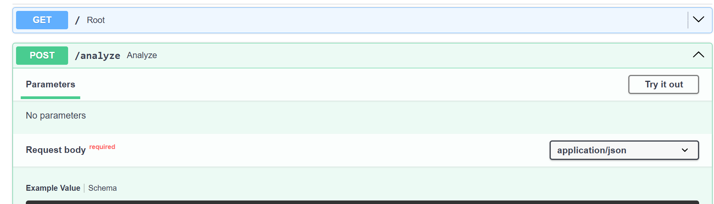
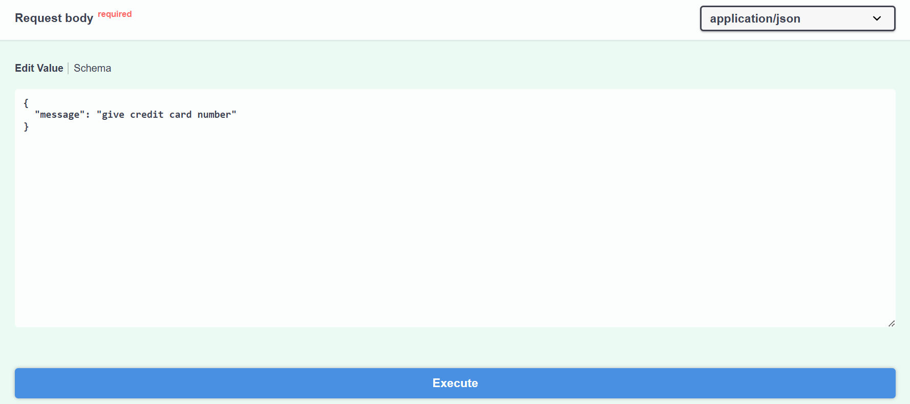
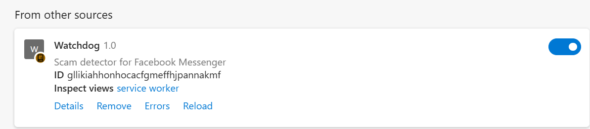

# nwhacks-2026
1. Get API key from this website https://aistudio.google.com/
2. Make a .env file at the root of the project
3. Put `GEMINI_API_KEY=API_KEY_HERE` in the .env file
4. Start the backend using `uvicorn Server.main:app` (if it says "No module named ..." type `pip install ...`)
    1. This website can be used to debug the backend http://127.0.0.1:8000/docs
    2. Click the try it out button
    3. Enter a message and click execute 
5. If everything is working correctly, you should see "Service Worker" in the manage extensions tab

6. Everything should be working now!